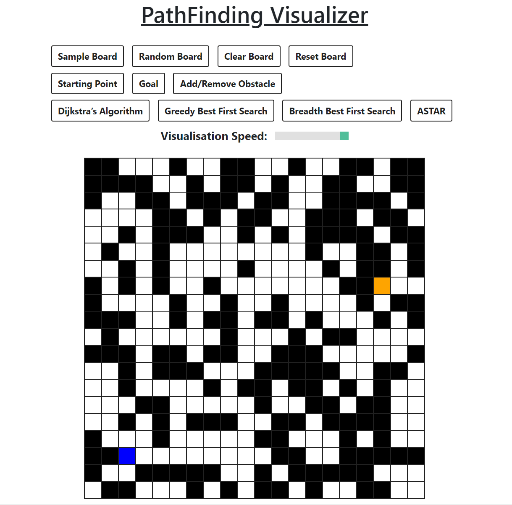

# Pathfinding Algorithms Visualizer

<b>See how pathfinding algorithms works visually! 🐾</b>

## <a href="https://xjqx.github.io/PathFinding-Visualizer">Website</a>

 

## Pathfinding Algorithms:
- **`Dijkstra’s Algorithm`**
- **`Greedy Best First Search`**
- **`Breadth Best First Search`**
- **`Astar Search`**

 

## Functions:

- `Create Sample Board`
- `Create Random Board`
- `Clear Board`
- `Reset Board`
- `Change Start Point`
- `Change End Point`
- `Add/Remove Obstacles`
- `Modify Visualisation Speed`
